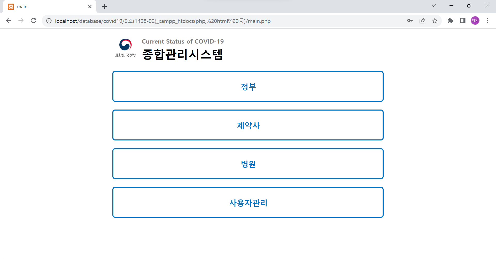
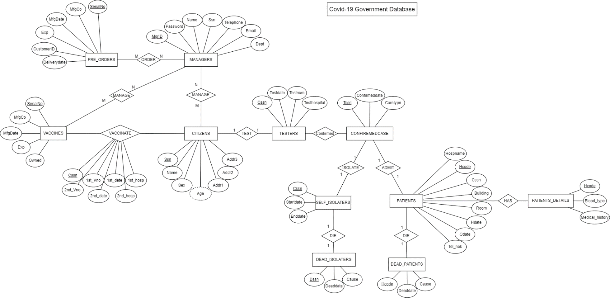
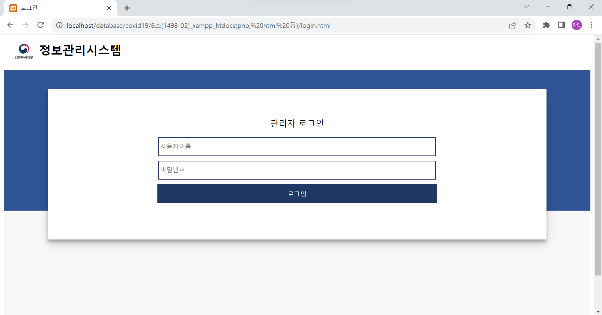
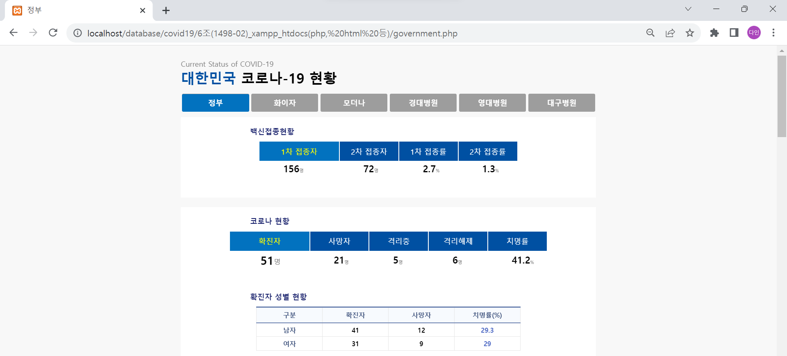
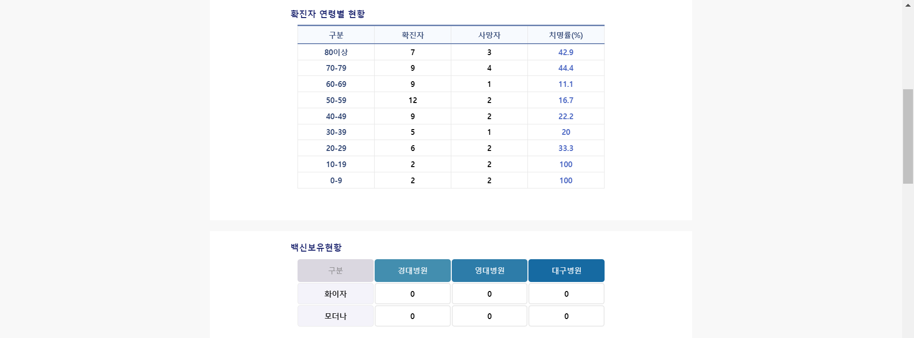
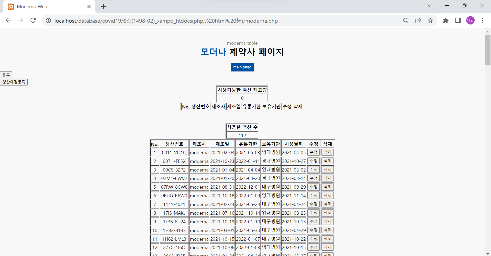
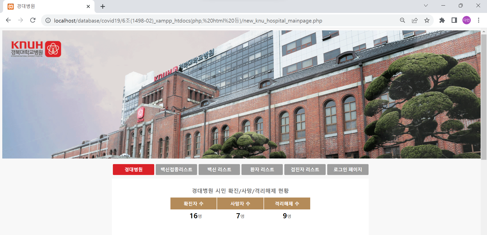

## :pill: Covid 19 종합관리시스템 :pill:

### Covid 19

- 약 1300 개의 데이터, 88개의 PHP 코드로 구성

### :office: 정부

- 코로나에 관한 종합적인 정보 제공 및 관리
- 관리자 로그인 후 접속 가능

### :syringe: 제약사 (모더나, 화이자)

- 각 제약사에서 제조한 백신에 대한 정보 제공 (제약사를 통해 확보된 정부 소유 백신)
- 확보된 백신 또는 미래 도입 예정인 백신을 각 제약사 사이트에서 관리

### :hospital: 병원 (경북대병원, 영남대병원, 대구병원)

- 해당병원에 입원한 Covid-19 환자에 대한 정보 관리
- 정부에서 관리되는 국민들의 정보를 참조하는 환자 정보 제공

## 개발 환경

- php, mysql

## Database Modeling - ER Diagram

## Result

자세한 내용은 ppt 파일 참고

### :eyes: 로그인

### :office: 정부

### :syringe: 제약사 (모더나, 화이자)

### :hospital: 경대병원

## 추후 개선 방안

- Trigger를 사용하여 정보의 수정이 이루어질때마다 참조된 테이블에 대한 업데이트가 일괄적으로 일어날 수 있도록 구현
- Stored Procedure를 활용하여 SQL 구문의 가독성 및 개발 효율을 증가
